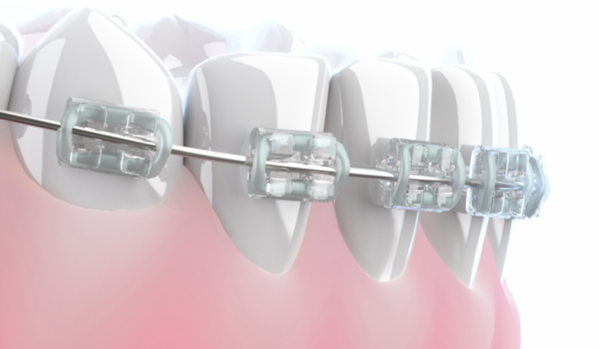
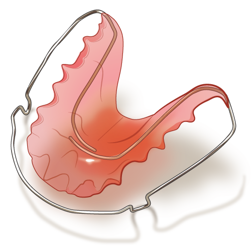

# 歯の矯正をしています
中2 電子工作班

## はじめに
こんにちは。中2の電子工作班です。 
私は去年(2025年)11月より歯の矯正をしました。 
その途中経過を綴る所存です。 

## 注意
以降に医療器具の話題や画像が出ます。
苦手な方は読むのをおすすめしません。

## 矯正までの準備
矯正器具を付け始めたのは25年11月からですが、実はその前に治療方針を立てるため、 
同年10月に歯の撮影を行いました。 
顔の写真や口腔内の写真を撮影してもらいました。 

私の場合上の歯並びが悪く、まず上にワイヤーを付けることになりました。
そして若干出っ歯気味なのでそれも治してもらうことになりました。

## 治療1「ワイヤーを使った歯列矯正」
 

ワイヤーについて先に説明すると、歯の表面に装置をつけ、ワイヤーを通して持続的な力をかけ、 
少しずつ歯を動かして歯並びと噛み合わせを整える方法です。 
ワイヤーは最初はゆるくして、だんだんきつくしていきます。 
なのでワイヤーの調整で1、2ヶ月に一度歯科医院に向かわないといけないことがデメリットです。 
時間は(私の場合)45分ほどです。特に運動部などの部活の人は時間調整を気にする必要があります。 
私の場合学校終わって家に帰ってすぐ行くとして、17:30や18:00の予約をしています 

## 治療2「保定装置を使った上顎前突の治療」
 
