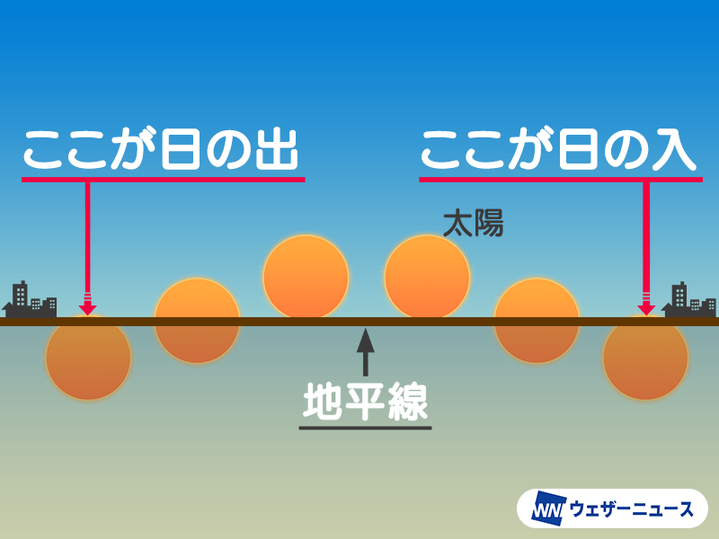

# プログラミングと天体
中3 編集
## 第一章「何をするか」
こんにちは。去年歯科矯正のことを書いた河合と申します。
 去年の文化祭が終わり、自分が編集の立場になりました。
 10月になると、日没が大分早くなったように感じました。
 そこから、「日出時刻」や「日没時刻」を求めてみたいな、と思うようになりました。
 
 みなさん、日の出の定義や日没の定義を知っていますか？中学受験では習うと思います。

 このように、ただ
